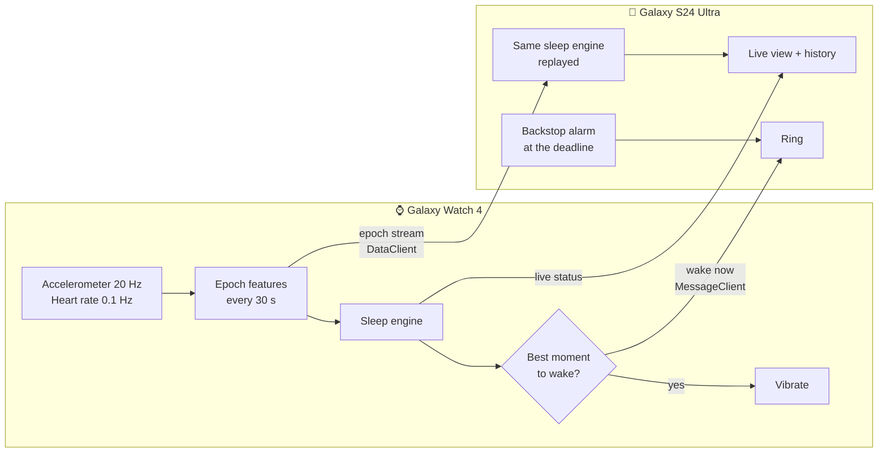

# Smart Alarm

**A sleep-cycle alarm for the Samsung Galaxy Watch 4 and your Android phone.**

Tell it how many sleep cycles you want. The watch reads your movement and heart rate all
night, works out where your cycles *actually* end, and wakes you at the best moment near the
time you asked for — out of light sleep, never mid-REM, never out of deep sleep.

<p align="center">
  <em>Watch = the sensors. Phone = the planning, the history, and the alarm that actually
  makes noise.</em>
</p>

---

## Why this is not just a timer

Most "sleep cycle" alarms multiply 90 minutes by a number. Real sleep cycles run anywhere from
70 to 120 minutes, your first cycles are shorter than your last ones, and no two nights are the
same. A 90-minute assumption is wrong by half an hour by the sixth cycle — which is exactly the
cycle you care about.

This app measures instead:

- Every 30 seconds it scores an epoch from wrist movement and cardiac features.
- A four-state model (awake / REM / light / deep) labels each epoch, solved across the whole
  night so the labels are consistent rather than flickering.
- A cycle boundary is drawn where a **REM period actually ends** — the textbook definition, not
  a stopwatch.
- The alarm target is recomputed continuously from the cycles measured *tonight*, so by your
  last cycle the projection rests on four or five real measurements.
- Inside a window around that target, it waits for a genuinely good moment to wake you, and
  becomes less fussy as the deadline approaches.

It also remembers. After a few nights it knows your cycle length, how long you take to fall
asleep, and your resting heart rate, and the very first cycle of the night is already
personalised.

## What you get

| | |
|---|---|
| **1 to 7 cycles** | From about 1 h 30 m to about 10 h 30 m, each option showing the clock time it would wake you at |
| **Three ways to wake** | Watch vibration only (silent for anyone else in the bed), phone alarm only, or both |
| **Smart wake window** | Up to 45 minutes early, configurable, or off for an exact-time alarm |
| **Live tracking** | Stage, heart rate, cycles completed, and a hypnogram that fills in as the night goes |
| **History** | Every night with its hypnogram, the cycles that were found, and how good the waking moment was |
| **Works apart** | The watch tracks and buzzes with no phone in range; the phone rings anyway if the watch goes quiet |

## How the two apps fit together



The watch owns the decision because it owns the sensors. The phone replays the identical epoch
stream through the identical engine, so the two can never disagree about what happened — and if
the watch's battery dies at 4 a.m., the phone already has an alarm parked at the deadline.

## Install

Grab both APKs from the [latest release](../../releases/latest).

**Phone** — open `smartalarm-phone.apk` on the device and allow installation from unknown
sources.

**Watch** — sideload over ADB:

```bash
adb pair <watch-ip>:<pairing-port>      # code shown on the watch
adb connect <watch-ip>:5555
adb -s <watch-ip>:5555 install smartalarm-watch.apk
```

Full step-by-step, including enabling developer mode on the watch and granting the heart-rate
permission, is in **[docs/INSTALL.md](docs/INSTALL.md)**.

> Both APKs are signed with the same key on purpose. Wear OS only lets a phone app and a watch
> app talk to each other if they share an application id *and* a signing certificate. Install
> the two from the same release or they will not pair.

## Use it

1. Open the app on your phone. It shows the wake time for every cycle count, based on the
   current time.
2. Pick your cycles and how you want to be woken.
3. Press **Start tracking**. The watch takes over.
4. In the morning you are woken in light sleep, somewhere in the window, and the night shows up
   in **Nights**.

You can also run the whole thing from the watch if your phone is in another room.

## How it works

The short version is above. The long version — the filters, Cole-Kripke scoring, the stage
model, how cycle boundaries are found, and how the wake moment is chosen — is in
**[docs/ALGORITHM.md](docs/ALGORITHM.md)**, along with how it was validated.

The module layout and the phone-watch protocol are in
**[docs/ARCHITECTURE.md](docs/ARCHITECTURE.md)**.

## Build it yourself

```bash
git clone https://github.com/ItzSuli/Smart-Alarm.git
cd Smart-Alarm
./gradlew test                      # the sleep engine's test suite
./gradlew :mobile:assembleRelease   # phone APK
./gradlew :wear:assembleRelease     # watch APK
```

You need JDK 17+ and an Android SDK with API 35. The repo ships a signing key so the two APKs
pair out of the box; see [docs/INSTALL.md](docs/INSTALL.md#using-your-own-signing-key) to
replace it with your own.

## Accuracy, honestly

A wrist sensor is not an EEG. Deep and REM sleep are *estimated* from how still you are and
what your heart is doing, which is the same evidence every consumer sleep tracker works from,
and it is good enough to find cycle boundaries and pick a waking moment. It is not good enough
to diagnose anything, and this app makes no medical claims.

Against synthetic nights built from a known hypnogram and driven through the real signal chain
from raw 20 Hz samples, the engine agrees with ground truth about **94%** of the time and places
cycle boundaries within a few minutes. Real nights are messier than synthetic ones. See
[docs/ALGORITHM.md](docs/ALGORITHM.md#validation) for what that number does and does not mean.

If the heart-rate sensor stops reporting, the app says so and stops claiming deep and REM
rather than inventing them, falling back to sleep/wake tracking and your usual cycle length.

## Licence

[MIT](LICENSE).
